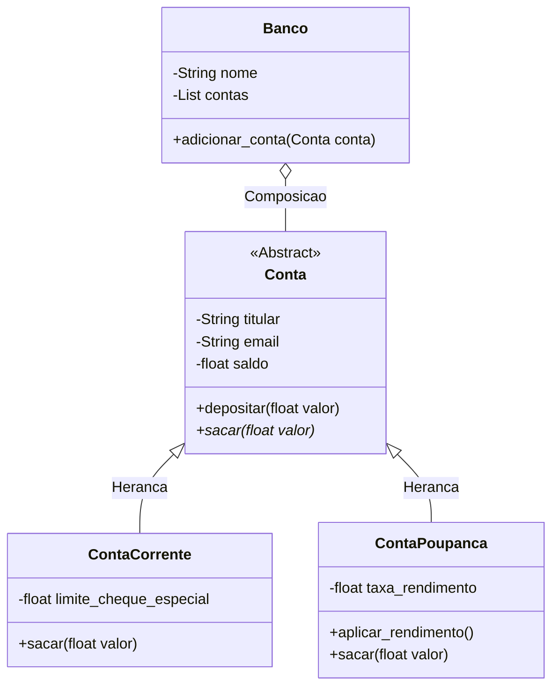

# Documento README.md: Contendo o diagrama de classes (preferencialmente em Mermaid), justificativa das decisões de modelagem (por que herança ou composição), exemplos de uso e explicação das validações aplicadas com @property.
# Sistema de Gestao de Contas Bancarias (POO)

Este projeto implementa um ecossistema completo de gerenciamento de contas bancarias utilizando os paradigmas da Programacao Orientada a Objetos (POO) em Python. O sistema realiza validacoes em tempo de execucao, organizacao de hierarquias corporativas e automacao de operacoes financeiras.

## Diagrama de Classes (Mermaid)



---

## Justificativa das Decisoes de Modelagem

1. Heranca (Relacao "E um"): As classes ContaCorrente e ContaPoupanca herdam diretamente da classe abstrata Conta. Essa abordagem foi adotada porque ambas compartilham uma base de propriedades comum (titular, e-mail e saldo), eliminando a duplicacao de codigo e centralizando as regras de seguranca basicas na classe mae.
2. Classe Abstrata (ABC): A classe Conta foi definida como abstrata para impedir que seja instanciada diretamente no sistema, uma vez que, conceitualmente, uma conta bancaria precisa ser de um tipo definido (Corrente ou Poupanca) para existir. O metodo sacar() foi marcado como abstrato para forcar cada modalidade a implementar suas proprias diretrizes de limite de saque.
3. Composicao (Relacao "Tem um"): A classe Banco utiliza composicao para agregar multiplas contas em uma estrutura interna de lista. Essa escolha desacopla o ciclo de vida das contas individuais das regras de administracao do banco em si.

---

## Explicacao das Validacoes com @property

O encapsulamento foi rigorosamente aplicado utilizando os decoradores @property e @setter. Isso garante a consistencia do estado do objeto, impedindo a atribuicao de dados anomalos:

*   Titular: O setter valida se a entrada nao esta vazia ou composta unicamente por espacos em branco.
*   E-mail: Implementa uma expressao regular (Regex) no setter que confere se o formato de texto inserido corresponde a estrutura padrao de e-mails, bloqueando formatos corrompidos antes da criacao do objeto.
*   Saldo: Protege o sistema contra a inicializacao de contas com balancos financeiros negativos.
*   Limite e Taxas: As classes filhas possuem validacoes exclusivas que nao permitem que limites ou taxas de rendimento operem com indices abaixo de zero.

---

## Exemplos de Uso

### Estrutura de Execucao no Terminal

O programa instancia 10 contas distintas de forma automatica, as organiza dentro da classe Banco e executa uma tentativa sequencial de saque de R\$ 200.00 para testar o comportamento polimorfico das classes derivadas.

Se o saldo e o limite de uma ContaCorrente permitirem, o saque e efetuado deixando o saldo negativo de forma controlada. Se uma ContaPoupanca nao possuir saldo suficiente, o erro e interceptado via try/except impedindo a queda total do sistema.

### Exemplo de Saida Limpa

```text
--- 1. CRIANDO 10 INSTANCIAS DE OBJETOS ---
Banco: Banco Central de Testes | Total de contas administradas: 10
Instancias salvas com sucesso.

--- 2. DEMONSTRACAO DE POLIMORFISMO (SAQUE DE R\$ 200 EM TODAS AS CONTAS) ---
Estado original -> Titular: Ana Silva | Saldo: R\$ 1500.00 [Corrente | Limite: R\$ 500.00]
Apos saque R\$ 200 -> Titular: Ana Silva | Saldo: R\$ 1300.00 [Corrente | Limite: R\$ 500.00]
--------------------------------------------------
Estado original -> Titular: Daniela Reis | Saldo: R\$ 0.00 [Corrente | Limite: R\$ 100.00]
Nao foi possivel realizar o saque para Daniela Reis. Motivo: Saldo e limite insuficientes para o saque de R\$ 200.00.
--------------------------------------------------

--- 3. TRATAMENTO DE EXCECOES (ENTRADAS INVALIDAS COM TRY/EXCEPT) ---
Tentando criar conta com e-mail incorreto...
[ERRO CAPTURADO]: O e-mail 'marcos_email_sem_arroba.com' possui um formato invalido.

Tentando criar conta com saldo negativo...
[ERRO CAPTURADO]: O saldo inicial nao pode ser negativo.
```
